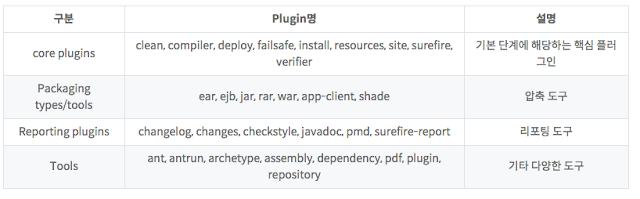

# JQuery

**화면의 동적 기능 쉽고 편리하게 개발 ; 자바스크립트 기반 라이브러리*** 

**여러개의 동작이 한 줄의 코드로 / 쉽고 명료 / 풍부한 플러그인* 제공 / 크로스브라우징***

***플러그인:** 호스트 응용 프로그램과 서로 응답하는 컴퓨터 프로그램. 웹 브라우저의 일부로서 **쉽게 설치되고 사용될 수 있는 프로그램**



***크로스브라우징** : **브라우저 종류에 상관없이 동일하게 기능 수행** 

***라이브러리**: 소프트웨어를 개발할 때 **컴퓨터 프로그램이 사용하는 비휘발성 자원의 모임**. (구성 데이터, 문서, 도움말 자료, 메시지 틀, 미리 작성된 코드, 서브루틴(함수), 클래스, 값, 자료형 사양)을 포함. 


## JQuery의 선택자

| 선택자 종류          | 선택자 표현 방법     | 설명                     |
| -------------------- | -------------------- | ------------------------ |
| All selector         | **$("*")**           | 모든 DOM선택             |
| **ID** selector      | **$("#id")**         | 해당되는 ID DOM          |
| **Element** selector | **$("elementName")** | 해당되는 이름 DOM        |
| **class** selector   | **$( ".className")** | 해당되는 클래스 이름 DOM |

***DOM: Document Object Model** 

**jQuery.html- id 속성, document 이벤트 처리함수, alert**

```html
<script>
$(document).ready(function(){ //document에 DOM이 로드되는 이벤트 처리함수
   alert($("#unique2").html()); //id 속성 사용 + html메서드
}); //id가 unique2인 태그 검색 -> html() 이용해 태그 값 가져와
</script>
<body>
    <div id="unique2"> //id 속성
         제이쿼리입니다!
    </div>
    
</body>
```

**jQuery2.html - id속성, 메소드에 인자 값 설정, 함수**

```html
<script>
function addHtml(){ //onClick 시, 함수 동적 기능
    $("#article").html('안녕하세요' + '<br>'); 
    //id가 article인 태그를 찾아 -> html()의 인자 값 태그에 설정
}
</script>
<body>
    <div>
        <p id="article"></p> //id속성 정의 
    </div>
    <input type="button" value="추가하기" onClick="addHtml()"/> 
    //click시, addHtml() 함수 정해
</body>
</html>
```

**jQuery3.html - 클래스 속성, 메소드에 인자 값 설정, 함수 **

```html
<script>
function addImage() { //함수 호출 
    $(".class1").html("");
} //해당 클래스 태그 찾아서  태그 추가 
</script>
<body>
    <div class="class1"> </div>
    <div class="class1"> </div>
    <input type="button" value="이미지 추가하기" onClick="addImage()"/> //addImage() 함수 
</body>
```

**jQuery4.html - 엘리먼트속성, 메소드에 인자 값 설정, 함수**

```html
<script>
function addImage() { //함수 호출 
    $("div").html("");
} //엘리멘트 태그 찾아서 html()이용  태그 추가 
</script>
<body>
    <div> </div>
	<div> </div>
    <input type="button" value="이미지 추가하기" onClick="addImage()" />
</body>
```

**jQuery5.html - id속성, 사용자입력내용 가져와 출력**

```html
<script>
function fn_process(){ //함수 
    var value = $("#t_input").val(); //id로 태그 접근 -> val() 이용, 사용자의 입력값 가져와 -> 변수에 저장
    $("#t_output").val(value); //값 출력
}
</script>
<body>
    <input type="text" id="t_input"/>
    <input type="button" value="입력하기" onClick="fn_process()" /><br><br>
    <div>
        결과: <br>
        <input type="text" id="t_output" disabled/>
    </div>
</body>
```

***val( ) :** 해당 엘리먼트의 값을 **가져오거나** 엘리먼트로 값을 **출력**하는 기능 


## JQuery Ajax 기능 

**Ajax :  Asynchronous JavaScript + XML** 

; 동시에 발생하지 않는 ; **비동기적** 

**클라이언트 측에서의 작업과는 상관없이,**  

**페이지 이동 없이** 데이터 처리 가능 (서버 비동기 요청 가능)

Client **<----- xml  or  JSON ----->** Server 통신 기술 

요청 페이지의 결과를 서버에서 처리 -> **원래 요청 페이지로 전송** 

(XML 이나 JSON 활용해서)

```HTML 
$.ajax ({
	type: "post or get",
	async: "true or false", //비동기식 처리할 지 여부 = True
	url: 요청할 url ,
	data: {서버로 전송할 데이터(매개변수)},
	dataType: "서버에서 전송받을 데이터형식",
	success:{
	//정상요청, 응답 시 처리 
},
	error: function(xhr, status, error){
	//오류 발생 시 처리 
}, 
	complete: function(data, textStatus){
	//작업 완료 후 처리 
},
});
```

예시) 

**AjaxTest1.java - 브라우저 데이터 받아 브라우저로 전송 **

*서블릿 : 브라우저에서 데이터를 받아오고 다시 데이터를 브라우저로 보내는 

클라이언트에서 ajax로 보낸 것 처리하는 서블릿

**브라우저에서** 매개변수 이름인 param으로 **데이터를 보내** 

그 데이터를 **getParameter( )로 가져와**

PrintWriter의 print( ) 메서드의 인자로 **응답 메시지를 브라우저로 전송** 

```java
String param = (String) request.getParameter("param"); //ajax로 전송된 매개변수를 가져온다. 
PrintWriter writer = response.getParameter("param");
write.print("안녕하세요! 서버입니다."); //print()를 이용해 브라우저에 응답 메세지를 보낸다. 
```

**ajax1.html** 

제이쿼리 ajax 기능 이용해 

서블릿의 **매개변수의 이름으로 메시지를 서버로 전송** //data: { }

**서버로부터 받은 메시지**를 **id의 속성에 해당하는 태그에 표시** 

//success: function (data, textStatus) {
                $('#message').append(data); 

//data가 인자 값 , 태그의 속성의 append( ) 메서드

```html
<script>
	function fn_process(){
        $.ajax({
            type: "get",
			async: "false", //동기식
			url: "http://localhost:8090/pro15/ajaxTest1",
			data: {param: "Hello, jQuery ajax"}, //서블릿매개변수 이름으로 메시지를 서버로 전송 
			dataType: "text",
			success: function (data,textStatus) {
                $('#message').append(data); //id 속성 + append()로 param 매개변수 받은 데이터 추가 
            },
            error: function (data,textStatus) {
                alert("에러가 발생했습니다.");
            },    
            complete: function (data,textStatus) {
            	alert("작업을 완료했습니다.");
            }
        })
    }
</script>
<body>
    <input type="button" value="전송하기" onClick="fn_process()" /> <br>
    <div id="message"> </div>
</body>
```

=> 전송하기 클릭하면, 서버에서 ajax로 전송된 데이터를 <div> 엘리먼트에 표시  

서버의 서블릿에서는 ajax로 전달된 매개변수 값을 콘솔로 출력

(서블릿에서 받은 매개변수를 data로 받아서 data를 함수를 이용해서 출력하기에)

client ----> ajax /브라우저 / 서버 <----->  서블릿


