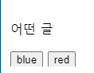

# JS 

사이트의 사용성을 배려하는 도구로서의 목적 

사용의 편의성 제공 

3원칙 

JS없이도 작동하는 사이트 + JS사용은 추가적인 사용성 제공 + JS 불안전 

# Document.getElementById()

`**Document.getElementById()**` 메서드: 주어진 문자열과 일치하는 [`id`](https://developer.mozilla.org/ko/docs/Web/API/Element/id) 속성을 가진 요소를 찾고, 이를 나타내는 [`Element`](https://developer.mozilla.org/ko/docs/Web/API/Element) 객체를 반환합니다. ID는 문서 내에서 유일해야 하기 때문에 특정 요소를 빠르게 찾을 때 유용합니다.

ID가 없는 요소에 접근하려면 [`Document.querySelector()`](https://developer.mozilla.org/ko/docs/Web/API/Document/querySelector)를 사용

- **매개변수** 

ID : 문서 내에서 유일애햐 함. 하나의 값은 하나의 요소만 사용가능.

- **반환값** 

문서 내에 주어진 ID가 없으면 `null`.

- **용법**

 메서드 이름 중 `"Id"`의 대소문자가 정확해야 합니다. 

`getElementById()`는 전역 `document` 객체의 메서드로만 사용할 수 있고, DOM의 다른 객체는 메서드로 가지고 있지 않습니다. 

**HTML이 아닌 문서**. DOM 구현체는 요소의 어떤 속성이 ID인지 알고 있어야 합니다.


**HTML**

```HTML
<html>
<head>
  <title>getElementById 예제</title>
</head>
<body>
  <p id="para">어떤 글</p>
  <button onclick="changeColor('blue');">blue</button>
  <button onclick="changeColor('red');">red</button>
</body>
</html>
```

**JavaScript**

```js
function changeColor(newColor) {
  var elem = document.getElementById('para');
  elem.style.color = newColor;
}
```

결과 



**HTML2**

```HTML
<!doctype html>
<html>
<head>
    <meta charset="UTF-8">
    <title>Document</title>
</head>
<body>
    <div id="parent-id">
        <p>hello word1</p>
        <p id="test1">hello word2</p>
        <p>hello word3</p>
        <p>hello word4</p>
    </div>
    <script>
        var parentDOM = document.getElementById('parent-id');
        var test1=parentDOM.getElementById('test1');
        //throw error
        //Uncaught TypeError: parentDOM.getElementById is not a function
    </script>
</body>
</html>
```

**JavaScript 2**

```js
var element = document.createElement('div');
element.id = 'testqq';
var el = document.getElementById('testqq'); // el이 null!
```

