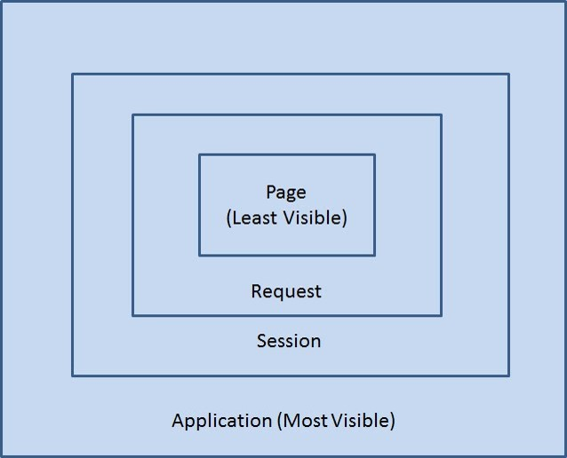

# JSP 

### 정의 

HTML, CSS, JS 기반으로 JSP에서 제공하는 여러가지 구성 요소들을 사용해 화면을 구현하는 기술

웹 프로그램의 화면 기능 + 모델 2 기반 MVC의 뷰(view) 기능 담당 

jsp 기본 태그, 액션 태그 

커스텀 태그 (개발자가 생성 혹은 프레임 워크에서 제공)


### 3단계 작업 과정 (JSP 변환 과정)

변환 -> 컴파일 -> 실행 

JSP 파일을 java파일로 -> 변환된  java 파일을 class 파일로 컴파일 -> 컨테이너는 class 파일을 실행, html, css, js 코드를 브라우저로 전송해 출력. 

*서블릿과 차이점 

: 서블릿 - 개발자가 html 태그 생성, println()로 전송 

**JSP** - **컨테이너가 자동으로** (JSP파일에 있는) html, js 를 **브라우저로 전송** 


## JSP 페이지 구성요소 

- 1. **디렉티브 태그** ; JSP 페이지에 대한 전반적인 설정 정보 지정 시에 사용

  - 페이지(전반적 설정정보)/인클루드(공통JSP페이지를 다른 페이지에 추가할 때) /태그라이브(개발자나 프레임워크에서 제공)

- 2. **JSP 스크립트 요소 -> 동적인 화면 구성 가능!**

  - 선언문 /스크립트릿(scriptlet)/표현식 /주석문 

- 3. **표현언어 (el; Expression Language)**

  - 연산자/내장객체(변수)/바인딩속성 / JSTL 라이브러리/Core태그 이용

- 4. **내장객체(변수)** **(Implicit Object)**

  - session , application, request 내장객체에 바인딩 
  - out 내장객체 이용해 데이터 출력 

- 5. **액션태그 ; 자바코드 없애는** 

  - 인클루드, 포워드 
  - useBean, setProperty, getProperty 액션 태그 사용 
  - 자바 빈, 유즈빈, setProperty, getProperty 액션태그 이용 


> ### 1. Directive Tag (디렉티브 태그)

#### 1> Page Directive Tag(페이지 디렉티브 태그) 

**<%@ 페이지 속성 = "값", ... , %>**

- 설정 jsp 속성 (대소문자 유의)

info / language / contentType / import / session / buffer* / autoFlush / errorPage / isErrorPage(현재 jsp 페이지가 예외 처리 담당 jsp 페이지인지 지정) / pageEncoding / isELIgonored 

*Buffer: 일시적으로 그 데이터를 보관하는 메모리의 영역.

*error 는 false가 기본값 


#### 2> Include Directive Tag(인클루드 디렉티브 태그)

**<% include file = "공통기능 .jsp" %>**

; 화면이 바뀌더라도 일정하게 유지 (제목이나 로고, 혹은 메뉴 )

포함한다. 

**include.jsp** 

```jsp
<%@ page language="java" contentType= ... %>
<body>
    <h1>
         안녕하세요. 쇼핑몰 중심 jsp 시작입니다. 
    </h1>
    <%@ include file="duke_image.jsp" %><br> //인클루드 디렉티브 태그 -> include.jsp 안에 duke_image.jsp가 포함되어 표시 
    <h1>
         쇼핑몰 중심 jsp 끝 입니다. 
    </h1>
</body>
```


#### 3> Taglib Directive Tag 


> ### 2. JSP 스크립트 요소 

HTML: 컨테이너 작업 X, 바로 브라우저로 전송 및 화면 구현 

JSP: 컨테이너에서 자바로 변환되는 과정 

( HTML태그 선택적 전송 가능 = 화면 동적으로 구성 가능)

=> JSP페이지에서 여러가지 동적처리 기능 제공

**선언문<%!  %> / 스크립트릿<% %> / 표현식<%=  %> / 주석문** 

```JSP
<% 자바코드 %>// 스크립트릿 (Scriptlet) 
	<% String age = request.getParameter("age"); %>

<%! 멤버변수 or 멤버 메서드 %> //선언문 (Declaration Tag)
	<%!
    String name = "듀크";
	public String getName(){ return name; }
	%> 

<%=값 or 자바 변수 or 자바 식 %> //표현식 - 변수 값 출력 시, 사용 
	<body>
        <h1>
             안녕하세요. <%=name %> 님 
        </h1>
        <h1>
             나이는 <%=age %>살 입니다. 
        </h1>
        
	</body>
```

=> **jsp의 스크립트 요소** ; 브라우저로 전송되기 전, **컨테이너에서 자바코드로 변환** 

#### 1> 선언문 <%! %>

<%! 멤버변수 or 멤버 메서드%>

#### 2> 스크립트릿 <% %>

<% 자바코드 %>

#### 3> 표현식 <%= %>

<%=값 or 자바 변수 or 자바 식 %>

 값을 출력하는 기능. 변수나 메서드의 결괏값 등을 브라우저에 출력 

**표현식에는 안에는 세미콜론(;) NO** 

#### 4> 주석문 <%-- --%> ; JSP 페이지에 대한 주석문 

<%--  내용 --%>


> ### 3. 표현언어 (el; Expression Language)


> ### 4. 내장객체 (변수)  (Implicit Object)

컨테이너가 자동으로 생성시키는 서블릿 멤버 변수  (Implicit Object)

(JSP -> servlet 으로 변환시킬 때)

> #### request / session / application 


- **jsp 제공 내장 객체들** 

| **request**     | **요청정보 저장**                         |
| --------------- | ----------------------------------------- |
| **response**    | **응답정보 저장**                         |
| **out**         | **결과 출력**                             |
| **session**     | **세션정보 저장**                         |
| **application** | **컨텍스트(웹 애플리케이션) 정보를 저장** |
| pageContext     | jsp페이지에 대한 정보 저장                |
| page            | jsp페이지의 서블릿 인스턴스 저장          |
| config          | jsp페이지에 대한 설정 정보 저장           |
| exception       | 예외 처리                                 |




- 내장객체들의 스코프(Scope)

웹 어플리케이션에서 생성된 변수 또는 객체가 유효한 범위.


**4가지 scope**

- **Application** : 웹 어플리케이션(컨텍스트)이 시작되고 종료될 때까지 변수를 유지하고자 할 때 사용.
- **Session** : 웹 브라우저 별로 변수를 관리하고자 할 때 사용
- **Request** : http 요청을 WAS가 받아서 웹 브라우저에게 응답할 때까지 변수를 유지하고자 할 때사용
- **Page** : 페이지 내에서 지역변수처럼 사용.


##### **1> Request 내장 객체에 데이터 바인딩 실습**  (WAS가 Http요청을 받아, 웹 브라우저에게 응답할 때까지 변수 유지 )

**request1.jsp (전송하기)** 

브라우저 요청에 대한 request 객체에 name과 address를 바인딩 

(setAttribute 이용)

 request 객체를 두 번째 jsp로 전송 

(RequestDispatcher 이용)

```JSP
<%@   %> //페이지 디렉티브 태그 (전반적인 정보설정)
<%
	request.setAttribute("name", "이순신");
	request.setAttribute("address", "서울시 강남구");
%>
<!DOCTYPE html>
<html>
<head>
</head>
<body>
<% 
    RequestDispatcher dispatch = request.getRequestDispatcher("request2.jsp");
    dispatch.forward(request, response);
</body>
</html>
```

**request2.jsp  (가져오기)**

첫 번째 jsp 에서 전송된 request 객체에서 바인딩된 name과 address를 가져와 (getAtttibute 이용)

```jsp
<%@   %> 
<% //포워딩된 request객체에서 getAttrinute()이용해 정보 가져와
	String name = (String) request.getAttribute("name");
	String address = (String)request.getAttribute("address");
%>
<!DOCTYPE html>
<html>
<head>
</head>
<body>
    //이전 jsp에서 전송된 정보를 출력 
    <h1> 이름은 <%=name %> 입니다. </h1>
    <h1> 주소는 <%=address %> 입니다. </h1>
</body>
</html>
```

결론

브라우저 -> request1.jsp 로 요청 

​					request객체에 바인딩한 후, request2.jsp로 포워딩하여 

-> request2.jsp 

전송된 정보 출력 


##### **2> Session 내장 객체에 데이터 바인딩 실습** (웹 브라우저별로 변수 관리)

**sessionTest.java**

서블릿에서 getSession()메서드를 이용해 

session 객체를 얻은 후 **name을 바인딩**  ( setAttribute() 이용 )

```java
@WebServlet("/sess")
public class SessionTest extends HttpServlet {
    HttpSession session = request.getSession(); //session객체를 가져와
    session.setAttribute("name", "이순신"); //session 객체에 name을 바인딩 
}
```

**session1. jsp**

jsp: 자동으로 세션 객체를 생성 

(servlet : getSession( ) 메서드 호출해서 세션 객체를 생성할 필요 x)

첫 번째 jsp 에서 session에 바인딩된 name값을 가져와

(getAttribute( ) 이용 )

session에 **address를 바인딩** (setAttribute( )  이용 ) 

```jsp
<% 
String name = (String) session.getAttribute("name");
session.setAttribute("address", "서울시 강남구");
%> 
:
<body>
    이름은 <%=name %> 입니다. <br>
    주소는 <%=address %> 입니다. <br>
</body>
</html>
```

**session2. jsp** 

```jsp 
<% 
String name = (String) session.getAttribute("name");
String address = (String) session.getAttribute("address");
%>
:
```

=> session1.jsp : 바인딩한 name 출력

 / session2.jsp :  바인딩한 name과 address를 출력 


##### 3> application 내장 객체에 데이터 바인딩 실습 (웹 애플리케이션이 시작되고 종료될 때까지 변수 유지 )

**appTest1.jsp**

session과 application 내장 객체에 name과 address 값을 바인딩 

```jsp
<% 
session.setAttribute("name", "이순신");
application.setAttribute("address", "서울시 성동구");
%>
:
<body>
    <h1>
        이름과 주소를 저장합니다. 
    </h1>
    <a href=appTest2.jsp> 두 번째 웹 페이지로 이동 </a>
</body>
</html>
```

**appTest2.jsp**

첫 번째 jsp에서 session과 application내장 객체에 바인딩한 값을 가져와

*같은 브라우저에서는 session과 application의 값에 접근 가능 

그러나, 다른 브라우저에서는 application의 값에만 접근 가능 

```jsp
<% 
String name = (String) session.getAttribute("name");
String address = (String) application.getAttribute("address");//다른 브라우저에서도 가능
%>
:
<body>
    이름은 <%=name %> 입니다. <br>
    주소는 <%=address %> 입니다. <br> //다른 브라우저에서도 가능
</body>
</html>
```


#### 4> out 내장 객체에 데이터 바인딩 실습 

**out1.jsp (전송하기)**

이름과 나이를 두 번째 jsp로 전송 

form 태그의 actioin 속성 이용> </form>

```jsp
<body>
    <form method="post" action="out2.jsp">
        이름: <input ... >
        나이: <input ... >
        <input type="submit" value="전송">
    </form>
</body>
</html>
```

**out2.jsp (출력하기)**

전송된 이름과 나이를 표현식과 out내장객체를 이용해 출력 

```jsp
<% 
request.setCharacterEncoding("utf-8");
String name = request.getParameter("name");
String age = request.getParameter("age");
%>
:
<body>
    <%
   if(name != null || name.length() != 0) {
    %>
    <h1> <%=name %> , <%=age %> </h1>
    <%
    } else {
     %>
    <h1> 이름을 입력하세요 </h1>
    <%
    }
   	 %>
    :
</body>
```

=> out 내장객체를 이용해 스트립트릿<% 자바코드 %>으로 출력하면 

복잡한 코드를 **상대적으로 간단히 출력 가능** 


> ### 5. 액션태그 ; 자바코드 없애는 

